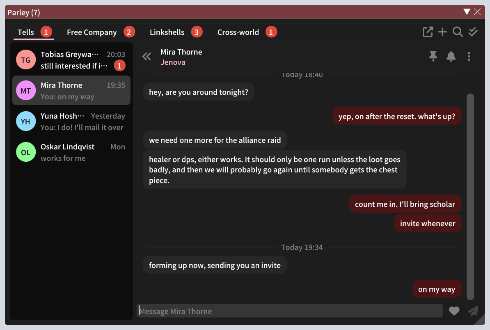
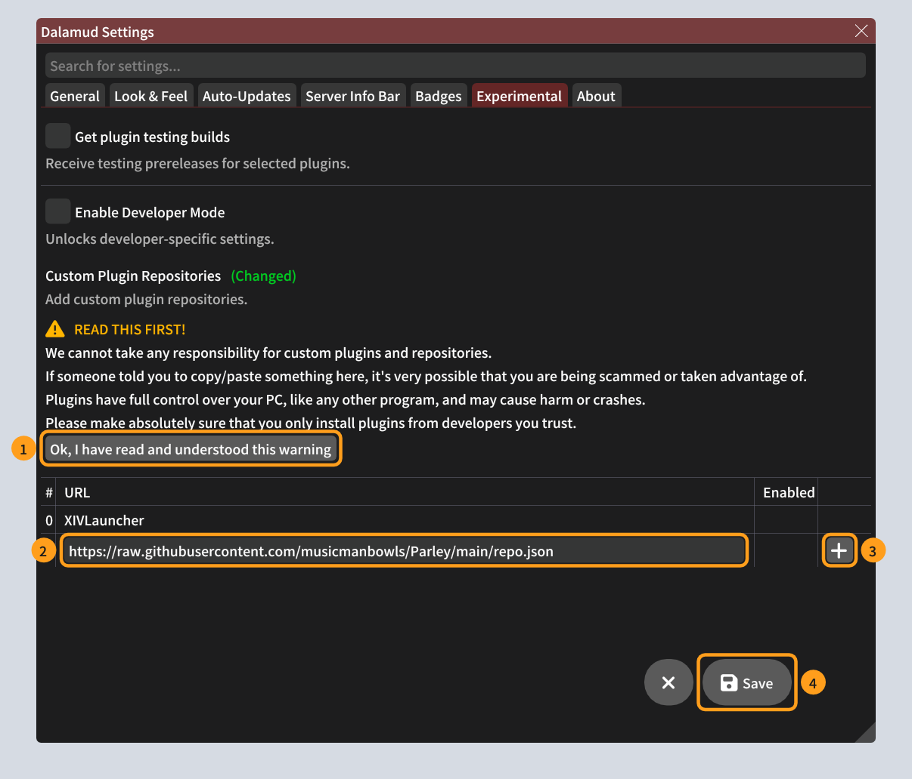
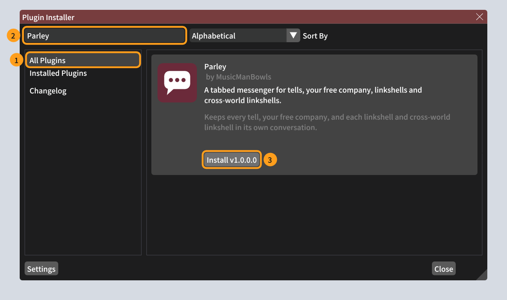
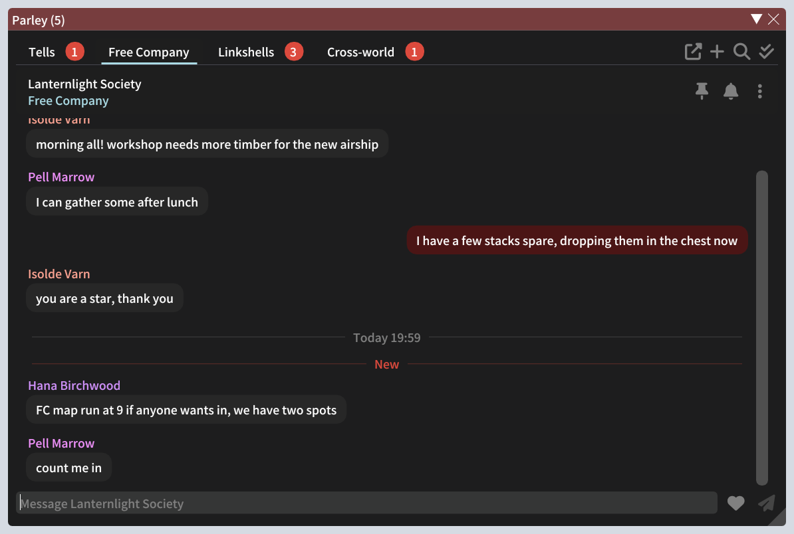
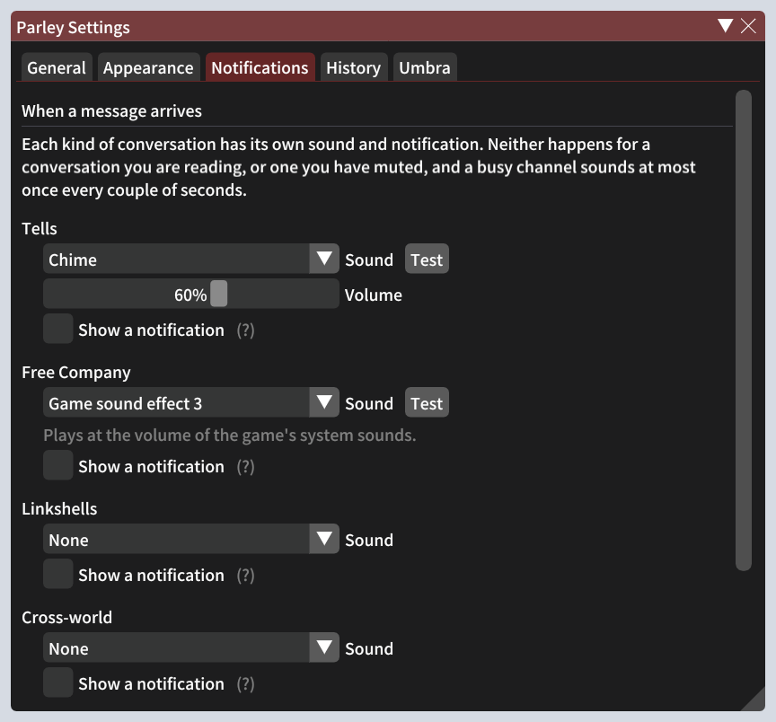

<p align="center">
  
</p>

<h1 align="center">Parley</h1>

<p align="center">
  A tabbed messenger for Final Fantasy XIV.<br>
  Your tells, free company, linkshells and cross-world linkshells, each kept as its own conversation in one tidy window.
</p>



Parley is a [Dalamud](https://github.com/goatcorp/Dalamud) plugin. It sits alongside the game's chat log and gives the conversations you care about a place of their own, like a messaging app.

## What it does

- **Every conversation in its place.** Tabs for Tells, Free Company, Linkshells and Cross-world, with your conversations listed down the side. Red badges count what you haven't read.
- **History that sticks.** Chat is saved per character, so conversations are still there after a restart. **Ctrl+F** searches all of it.
- **Reply right there.** Type at the bottom and press Enter. Long messages are split for you. Link an item into your reply, or pick a symbol the game can show (♥ ★ ♪ and more) from the heart button.
- **Links that work.** Web links open in your browser. Item links show the game's own tooltip and the chat log's options (try on, compare, find in your inventory, recipes that use it). Map flags open the map.
- **Highlight and copy.** Drag across messages to select them, then press Ctrl+C, just like the game's chat.
- **See who's around.** Tells with friends show whether they're online, away, busy (`/busy`) or in a duty, and which duty. Offline friends fade.
- **Works like the game's chat.** Enter sends and hands the keyboard back to the game. Enter again puts you back in Parley. **Alt+Enter** brings Parley up from anywhere, ready to type.
- **Sounds and pop-ups.** A sound of your choosing for each kind of chat (one of Parley's, one of the game's, or your own WAV file), plus optional notifications.
- **Your look.** Follow Dalamud's style, any of the game's eight UI themes (the same as the game or a different one), or your Umbra colours.
- **Windows of their own.** Pop Free Company, Linkshells or any other tab out into a separate window.
- **Optional extras.** Keep these chats out of the game's chat log (speech bubbles still show the right words), an unread count in the server info bar, and an [Umbra](https://github.com/una-xiv/umbra) toolbar button.

## Installing

Parley isn't in Dalamud's official plugin list, so you add Parley's own list once. Updates then arrive by themselves, like any other plugin's.

You need Final Fantasy XIV started through XIVLauncher, with plugins working (you can open `/xlplugins` in game).

### 1. Add Parley's plugin list

1. In game, type `/xlsettings` and open the **Experimental** tab.
2. Under **Custom Plugin Repositories**, read the warning and click **Ok, I have read and understood this warning**. You only do this the first time, and the button unlocks after 15 seconds.
3. Paste this address into the empty box at the bottom of the list, then click the **+** beside it:

   ```
   https://raw.githubusercontent.com/musicmanbowls/Parley/main/repo.json
   ```

4. Check that **Enabled** is ticked on the new line, then click **Save**, the round button at the bottom right.



### 2. Install Parley

1. Type `/xlplugins` to open the Plugin Installer, and click **All Plugins**.
2. Search for **Parley**.
3. Click Parley to open it up, then click **Install**.



<sub>Pictures of Parley come from the plugin itself. Pictures of Dalamud's windows are illustrations, so yours may look slightly different, but the words match.</sub>

### 3. Open it

Type `/parley` to open or close the window. Tells, free company, linkshell and cross-world linkshell messages collect in it from now on. Chat from before you installed it won't appear.

## Using Parley



- Click a tab to switch between Tells, Free Company, Linkshells and Cross-world.
- Start a new tell with the **+** at the top right, with `/parley First Last@World`, or by right-clicking a player in game and choosing **Message in Parley**.
- Right-click a conversation, a message or a tab for more: pin, mute, copy, give someone's name a colour of your choosing, pop a tab out into its own window, and so on.
- Click an item link for the item menu. **Link in your reply** puts the item in what you're typing.
- The cog in the window's title bar, or `/parley config`, opens the settings.

### Keys

| Key | What it does |
| --- | --- |
| **Enter** | Sends what you've typed. With the setting on (the default), it also hands the keyboard back to the game. |
| **Enter**, when not typing | While Parley is the chat you're using, puts you back in its reply box. Otherwise the game's chat box opens as usual. |
| **Alt+Enter** | From anywhere: brings Parley up, ready to type. If it's closed, it opens on the newest message someone sent you. |
| **Alt+R** / **Alt+Shift+R** | Next or previous conversation in the tab, while Parley has focus. |
| **Ctrl+F** | Search. |
| **Ctrl+C** | Copy highlighted text. |

The Enter, Alt+Enter and Alt+R behaviours can each be turned off in the settings.

### Commands

| Command | What it does |
| --- | --- |
| `/parley` | Open or close the window |
| `/parley First Last@World` | Start a tell with that player |
| `/parley <part of a name>` | Open an existing conversation |
| `/parley read` | Mark everything as read |
| `/parley friends` | Check what Parley can see of your friend list |
| `/parley config` | Open the settings |

### Sounds and notifications



By default Parley is silent. In the settings, the **Notifications** tab gives each kind of chat its own sound (one of Parley's, one of the game's sound effects, or a WAV file of your own), a volume, and a pop-up notification if you want one. **Test** plays the sound so you can hear it.

The **Appearance** tab changes how Parley looks: Dalamud's style, a game UI theme, or your Umbra colours.

## Optional: the Umbra toolbar button

If you use [Umbra](https://github.com/una-xiv/umbra), Parley can put a button on its toolbar that shows how many messages are waiting. Left-click opens Parley; right-click marks everything as read.

1. Download **Umbra.Parley.dll** from the [latest release](https://github.com/musicmanbowls/Parley/releases/latest) and save it somewhere it can stay, rather than Downloads.
2. Type `/umbra` to open Umbra's settings, and pick **Plugins** on the left.
3. The first time, Umbra shows a word of warning about plugins made by other people. Tick **I have read and agreed to the above statement**.
4. Under **Install from file**, click **Browse...** and choose `Umbra.Parley.dll`.
5. Click **Restart Umbra** when it asks.
6. In Umbra's settings, pick **Toolbar Widgets**, click **Add Widget** where you want it, search for **Parley** and click **Add Parley**.

The widget's own settings choose its wording ("2 new Tells", "T:2 FC:0 LS:5 CW:1" or "8 new messages") and which chats it counts. It's built for Umbra 3.1. To update it, install the new DLL from a later release the same way.

Not using Umbra? Parley puts the same unread count in the game's server info bar at the top of the screen, and clicking it opens the window.

## If something goes wrong

| What you see | What to do |
| --- | --- |
| Parley isn't in the Plugin Installer | Check the address was copied whole, that **Enabled** is ticked and that you clicked **Save**. Then close and reopen `/xlplugins`. |
| Friends show no status | Type `/parley friends` to see what Parley can see. Opening the game's friend list once also fetches it. |
| An error, or something looks wrong | Type `/xllog` to open Dalamud's log, take a screenshot of any red lines that mention Parley, and [open an issue](https://github.com/musicmanbowls/Parley/issues) saying what you were doing. |

## Your data

Your chat history and settings stay on your PC, in `%AppData%\XIVLauncher\pluginConfigs\Parley`. Parley doesn't send anything anywhere. Messages you write go out through the game's own chat, exactly as if you'd typed them there, and web links only open when you click them.

## Building from source

You need the [.NET 10 SDK](https://dotnet.microsoft.com/download) and XIVLauncher with Dalamud installed, since the build uses Dalamud's own files.

```
dotnet build Parley.sln -c Release
dotnet test tests/Parley.Tests
```

The plugin package lands in `Parley/bin/Release/Parley/latest.zip`. The Umbra companion builds against the Umbra you have installed. `tests/Parley.UiHarness` draws Parley's real windows outside the game, which is where the pictures above come from.
